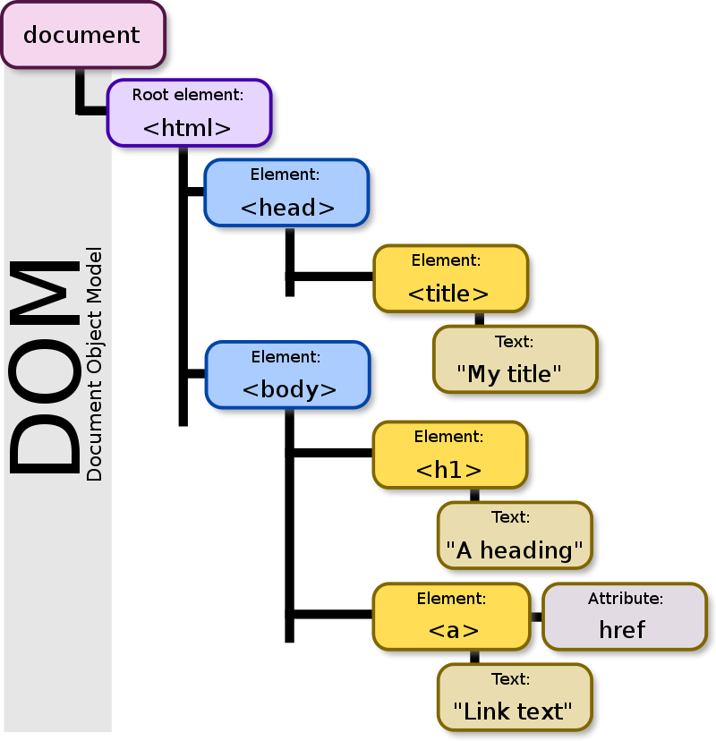

DOM, Document Object Model'ın kısaltmasıdır ve web sayfalarının yapısını programatik olarak temsil etmek için kullanılan bir standarttır. HTML, XML veya XHTML gibi belge tabanlı dillerdeki web sayfalarını bir ağaç yapısı olarak temsil eder. Her bir HTML etiketi veya XML öğesi, DOM içinde bir nesne olarak temsil edilir.

DOM, web tarayıcıları tarafından oluşturulan bir programlama arayüzüdür ve web geliştiricilerinin JavaScript gibi programlama dillerini kullanarak web sayfalarının içeriğine, yapısına ve stillerine erişmelerini, bunları değiştirmelerini ve manipüle etmelerini sağlar.

DOM, bir web sayfasının her öğesini bir nesne olarak ele alır ve bu nesneler arasındaki ilişkileri bir ağaç yapısı şeklinde temsil eder. Bu, geliştiricilerin belge içeriğine dinamik olarak erişmelerine ve kullanıcı etkileşimlerine yanıt vermelerine imkan tanır. Bu sayede, web sayfaları kullanıcı etkileşimlerine uygun olarak güncellenebilir, öğeler eklenip çıkarılabilir veya değiştirilebilir.

 

